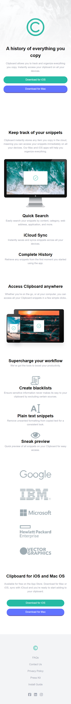

# Frontend Mentor - Solución de la página de inicio de Clipboard

Esta es una solución para el desafío [Clipboard landing page](https://www.frontendmentor.io/challenges/clipboard-landing-page-5cc9bccd6c4c91111378ecb9) en Frontend Mentor.

### El desafío

Los usuarios deberían poder:

- Ver el diseño óptimo del sitio según el tamaño de la pantalla de su dispositivo.
- Ver estados de cambio al pasar el ratón sobre todos los elementos interactivos de la página.

### Captura de pantalla

A

### Enlaces

- URL de la solución: [Agregar URL de la solución aquí](https://tu-url-de-solución.com)
- URL del sitio en vivo: [Agregar URL del sitio en vivo aquí](https://tu-url-de-sitio-en-vivo.com)

## Mi proceso

### Construido con

- Marcado semántico HTML5
- TailwindCss
- Flujo de trabajo de diseño móvil primero.

## Autor

- Github - [Breyner Esmith Ustariz Hoyos](https://github.com/Breynersmith)

- Linkedin - [Breyner Esmith Ustariz Hoyos](https://www.linkedin.com/in/breynerustariz/)
- Frontend Mentor - [@Breynersmith](https://www.frontendmentor.io/profile/Breynersmith)

